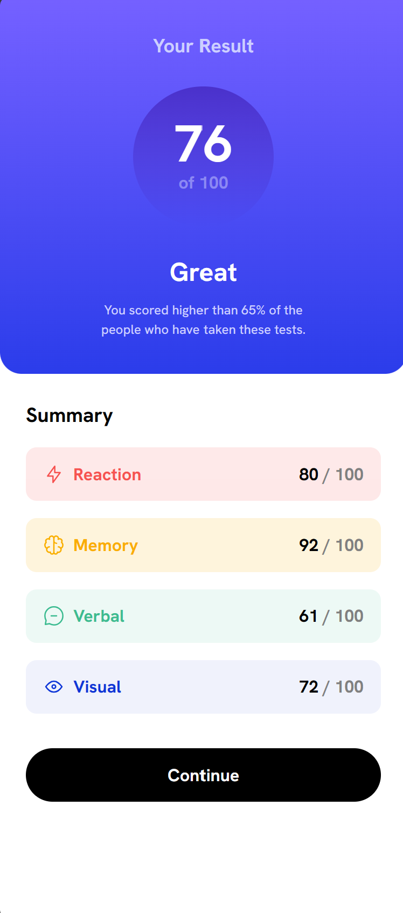

# Review of the Results summary component challenge

## Table of contents

- [Overview](#overview)
  - [The Goal](#the-goal)
  - [Screenshot](#screenshot)
  - [Links](#links)

- [My process](#my-process)

- [Problems I encountered](#problems-i-encountered)
- [What I learned](#what-i-learned)
- [Useful resources](#useful-resources)
- [Feedback from Mentors](#feedback-from-mentors)
- [Acknowledgments](#acknowledgments)
- [Built with the following tools](#built-with)

- [Areas of Continued Development](#continued-development)

## Overview

### The Goal
Users should be able to:

1. View the optimal layout for the interface depending on their device's screen size.
2. See hover and focus states for all interactive elements on the page
3. **Bonus**: Use the local JSON data to dynamically populate the content

### Screenshot

### Links

- Solution URL: [Add solution URL here]()
- Live Site URL: [Live site](https://fumzy123.github.io/results-summary-component/)

## My process
I took this challenge to practice the CSS skills I have gained from an online course. Here is my thought process.

1. Observe the Layout to Note some important things: The first thing I did was observe the layout of the component. I decided to use a mobile first approach for the design
    - The "Your Result" Portion: This container did not need a layout tool for the mobile-view because it was mostly text elements so I left it at that.
    - The Summary Portion: This container did not need a layout tool like flex-box for the mobile view either. It simply a
      - A title
      - A list of div elements: Each div element in the list needed a flex-box layout to achieve the design. A flex-direction of row and space-between could solve that.
      - A button.
      All these elements can be spaced out with margins.

2. Add in my HTML content to define the structure.

3. Add CSS Reset: After noting down the important things I could observe in the website I created my CSS resets.

4. Style each portion in mobile view based on my observation.

4. Added Responsiveness: Once I had these two parts sorted I decided to add ressponsiveness to the component. 
    -  `Your Result` container : I observed the left side of the component and noticed that its container had a purple-gradient with rounded borders. The elements within were a bunch of text elements so I thought to myself that a flex-box would be overkill to align them. I can easily center align them by simply using the text-align property, and the margin-inline property. 

    - `Summary` container: The right side of the container was kind of tricky. I first thought that it had a white background and rounded right border edges, but I noticed that the white background was seamlessly connected to the purple container on the left hand side suggesting to me that the white background is not the color of the Summary Container but rather the container of the larger background that both the left container and the right container are sitting on. Therefore the Summary container on the left does not have a background color, and the rounded edges I see are the edges of the larger container that they both share.
    
    I closely inspected the elements on the right hand side of the component. It was a 1 dimensional layout and so i decided to use flex-box for the layout because it was combination of text buttons and a list.

## Problems I encountered

1. `Reaction, Memory, Verbal, and Visual`: The list of elements on the right was quite challenging for me. I ended up using an `<ul><li></li></ul>` to represent them. I am not sure if that was the right element to use. Each div element has a background color, and a 1 dimensional layout that I modelled using a flex-box.

2. `Reaction, Memory, Verbal, Visual and their image icon`: I ran into some alignment issues with the alignment of the image icon and the text to the left of it. I had a couple of approaches in mind.
  - Using a pseudo element to append it to the start of the div but that failed because it wasn't in the background.
  - Using it as the image-icon for the bullet list and then trying to put it inside the div container but that failed too because everytime i set my div to flexbox it fell apart.
  - I wrapped both elements in a div and then set the text beside it to have a display of inline-block but the text did not sit on the same line with the icon. The vertical alignment was slightly off. I couldn't understand why.
  I decided to add the image in my html and wrap both of them in a div. I set the div to flexbox and they aligned. It was the solution I thought of initially but I wanted to see if there was a solution outside of using flexboxes. Because it looked so simple to accomplish than.

## What I learned

 1. min-height sets the minimum height of an element, but allows it to grow if the content needs more space.

 2. Coding Mobile first was helpful to this design.

 3. Using the Fetch API to get json data, and Using the Browser API to update the DOM.

 ## Useful resources

- [Example resource 1](https://www.example.com) - This helped me for XYZ reason. I really liked this pattern and will use it going forward.
- [Example resource 2](https://www.example.com) - This is an amazing article which helped me finally understand XYZ. I'd recommend it to anyone still learning this concept.

**Note: Delete this note and replace the list above with resources that helped you during the challenge. These could come in handy for anyone viewing your solution or for yourself when you look back on this project in the future.**

## Feedback from Mentors
1. Include a Modern CSS reset ?
 a. [A Modern CSS Reset by andy Bell](https://andy-bell.co.uk/a-more-modern-css-reset/)

2. Link your fonts in the HTML header do not import them. Importing fonts damages peformance

3. Use min height never height on the body.

## Acknowledgments

This is where you can give a hat tip to anyone who helped you out on this project. Perhaps you worked in a team or got some inspiration from someone else's solution. This is the perfect place to give them some credit.

## Built with
- Semantic HTML5 markup
- CSS custom properties
- Flexbox
- Desktop-first workflow

## Continued development
<!-- Use this section to outline areas that you want to continue focusing on in future projects. These could be concepts you're still not completely comfortable with or techniques you found useful that you want to refine and perfect. -->

1. Typography approach
  a. What are the correct headers for this project ?
    - Your Result -> h2
        - 76 -> (p -> strong)
        - Great -> h3
    - Summary -> h2
        - Reaction -> h4
        - Memory -> h4
        - Verbal -> h4
        - Visual -> h4
  
2. Layout approach
  a. Why does my icon not align with my text ?

3. CSS File Organization ?
  a. Where do you create CSS variables ?
    - global.css
    - utils.css
  
  b. What is the best way for me to organize my CSS files, and how does CSS imports impact performance ?
 

------------------------------------------------------------------------

<!--

If you want more help with writing markdown, we'd recommend checking out [The Markdown Guide](https://www.markdownguide.org/) to learn more.

## Author

- Website - [Add your name here](https://www.your-site.com)
- Frontend Mentor - [@yourusername](https://www.frontendmentor.io/profile/yourusername)
- Twitter - [@yourusername](https://www.twitter.com/yourusername)

**Note: Delete this note and add/remove/edit lines above based on what links you'd like to share.**

## Challenge Solution
This is a solution to the [Results summary component challenge on Frontend Mentor](https://www.frontendmentor.io/challenges/results-summary-component-CE_K6s0maV). Frontend Mentor challenges help you improve your coding skills by building realistic projects.  

-->